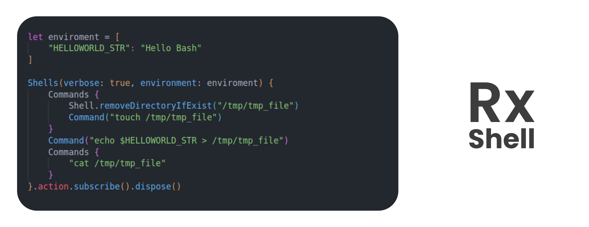

<h1 align="center">
  <br>
  
  <br>
  <br>
</h1>

<h4 align="center">Use Swift Play with Shell in Reactive X Way</h4>

<p align="center">
  <a href="#key-features">Key Features</a> •
  <a href="#how-to-use">How To Use</a> •
  <a href="#related">Related</a> •
  <a href="#license">License</a>
</p>

## Key Features

- All write in **Swift**
- Run shell in Reactive X way
- DSL Interface for create shell command
- Custom Pipe
- Custom Enviroment
- [ ] Macro Support

## How To Use

```swift
let enviroment = [
    "HELLOWORLD_STR": "Hello Bash"
]

Shells(verbose: true, environment: enviroment) {
    Commands {
        Shell.removeDirectoryIfExist("/tmp/tmp_file")
        Command("touch /tmp/tmp_file")
    }
    Command("echo $HELLOWORLD_STR > /tmp/tmp_file")
    Commands {
        "cat /tmp/tmp_file"
    }
}.action.subscribe().dispose()
```

### Verbose
If you don't want RxShell Output shell command result, you can just set verbose to `false`

```
Shells(verbose: false) {
    // Commands
}
```

## Related

> Thanks:
> - [ShellOut](https://github.com/JohnSundell/ShellOut)
> - [RxSwift](https://github.com/ReactiveX/RxSwift)

## License

MIT License

---
